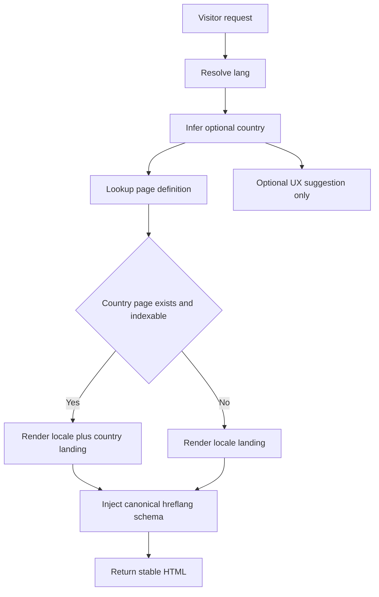

# Country-Based Landing SEO Technical Architecture Plan

This plan builds on the existing locale-aware routing, metadata injection, and sitemap foundations already present in [`app/main.py`](app/main.py).

## Objective

Create a scalable architecture that lets Norya rank with country-relevant landing experiences without fragmenting SEO signals or introducing unsafe geo-redirect behavior.

The target is not a separate country site system first. The target is a layered architecture:

- locale-first public URLs
- optional country-aware content variations
- stable canonical rules
- complete hreflang coverage
- sitemap expansion for indexable country-targeted pages
- reusable metadata and template infrastructure

## Current foundation already in the codebase

The current app already has most of the primitives needed:

- browser language parsing in [`_parse_accept_language()`](app/main.py:1149)
- IP-based country inference in [`_get_country_from_request()`](app/main.py:1187)
- locale suggestion API in [`get_locale()`](app/main.py:1215)
- landing HTML rewriting in [`_landing_response()`](app/main.py:2881)
- preferred locale resolution in [`_preferred_landing_locale()`](app/main.py:8276)
- locale-aware homepage helper in [`localized_home_path()`](app/main.py:8298)
- locale-prefixed homepage route in [`index_with_locale()`](app/main.py:8492)
- locale-prefixed SPA route handling in [`index_with_locale_path()`](app/main.py:8536)
- sitemap generation in [`sitemap_xml()`](app/main.py:8128)
- robots output in [`robots_txt()`](app/main.py:8075)

This means the correct direction is to extend the locale system rather than creating a parallel country-routing stack.

## Recommended architecture

### 1. Public URL model

Use a three-layer URL strategy.

Layer 1 is the permanent global entry model:

- `/en`
- `/de`
- `/tr`
- other supported locales already recognized by [`_parse_accept_language()`](app/main.py:1149)

Layer 2 is locale-specific commercial and SEO pages already supported by the existing route style, for example:

- `/de/pricing`
- `/en/blog`
- `/fr/ai-blood-test-analyzer`

Layer 3 is optional country-targeted SEO landing pages nested under locale, not replacing locale homepages. Recommended pattern:

- `/{lang}/countries/{country_code}`
- `/{lang}/countries/{country_code}/{slug}`

Examples:

- `/en/countries/de`
- `/de/countries/de`
- `/en/countries/gb/private-blood-test-results`

Why this structure is preferred:

- it keeps language as the primary indexable dimension
- it avoids multiplying root-level route ambiguity
- it fits the current locale-prefixed routing model in [`index_with_locale()`](app/main.py:8492)
- it allows country pages to be added incrementally without changing the homepage contract

### 2. Canonical strategy

Canonical rules must prevent near-duplicate pages.

Recommended rules:

- locale homepages canonically self-reference, for example `/de` canonical to `/de`
- locale service pages canonically self-reference, for example `/de/pricing` canonical to `/de/pricing`
- country pages canonically self-reference only when their content is materially country-specific
- if a country page differs only by minor copy tweaks, canonical should point back to the parent locale page instead of self-canonicalizing

This means country pages should only be indexable when they have at least one of these:

- country-specific headline and value proposition
- country-specific trust or compliance details
- country-specific examples, units, terminology, or CTA framing
- country-specific FAQ or schema content

The existing canonical injection in [`_inject_canonical()`](app/main.py:2873) and [`_landing_response()`](app/main.py:2881) should become the shared mechanism for both locale and country pages.

### 3. Hreflang strategy

Use hreflang at two content tiers.

For locale homepages:

- alternate links should continue covering all supported locales
- `x-default` should point to the default global landing such as `/en`

For country-specific landing clusters:

- alternates should link only to equivalent country-intent pages across languages
- `x-default` should point to the broadest global equivalent, usually the locale-neutral English version for that page family

Example cluster:

- `/en/countries/de`
- `/de/countries/de`
- `/tr/countries/de`

These should reference each other as alternates, not every unrelated page on the site.

Important rule: hreflang should map equivalent intent, not merely any translated page.

The current hreflang injection logic in [`_landing_response()`](app/main.py:2881) and in page-specific templates should be generalized into a reusable hreflang builder for country page families.

### 4. Sitemap model

Split indexability from discoverability.

Recommended sitemap behavior:

- keep all primary locale pages in the main sitemap generated by [`sitemap_xml()`](app/main.py:8128)
- add country-targeted URLs only when marked indexable in data
- exclude experimental or thin country pages from sitemap until content quality is ready
- optionally evolve to sitemap index files later if country coverage grows significantly

Recommended internal data flags per country landing:

- `indexable`
- `canonical_target`
- `locale_variants`
- `lastmod`
- `page_type`

This keeps search engines focused on strong pages instead of flooding the index with lightly differentiated URLs.

### 5. Country detection behavior

Country detection should influence UX, not force crawl paths.

Recommended rules:

- no automatic server-side geo-redirect for crawlers or first-time users
- no redirect from `/en` to `/de/countries/de` based only on IP
- use [`_get_country_from_request()`](app/main.py:1187) only for suggestions, banners, smart CTAs, or locale recommendations
- retain direct access to any locale URL regardless of user country
- treat `/api/locale` from [`get_locale()`](app/main.py:1215) as a recommendation endpoint, not an indexing decision endpoint

Preferred UX flow:

- user lands on a stable locale page
- app detects probable country and language
- app optionally shows a non-blocking suggestion such as a localised CTA or country guide link
- user can dismiss or switch

This protects SEO from cloaking-like behavior and prevents poor crawler consistency.

### 6. Rendering model

Do not fork `static/index.html` per country.

Instead, extend the existing rendering pattern used by [`_landing_response()`](app/main.py:2881):

- base HTML remains shared
- a structured metadata object drives title, description, OG, canonical, hreflang, schema, CTA, and page modules
- locale and country become separate inputs

Recommended internal rendering contract:

- `lang`
- `country_code`
- `page_kind`
- `slug`
- `indexable`
- `canonical_url`
- `alternate_urls`
- `meta`
- `ui`
- `schema_blocks`

This can support three rendering tiers:

- locale homepage
- locale SEO landing
- locale plus country landing

## Recommended data model

Introduce configuration-driven page definitions instead of hardcoding each country page in route logic.

Recommended structures:

- locale registry
- country registry
- country-to-market metadata
- landing page registry
- page intent definitions

Suggested conceptual schema:

```text
CountryLandingPage
- lang
- country_code
- slug
- page_type
- indexable
- canonical_mode
- title
- description
- hero
- faq_items
- trust_modules
- internal_links
- schema_payload
- lastmod
```

Recommended source location options:

- a dedicated Python config module near existing i18n and SEO dictionaries
- or JSON/YAML content files if non-code editing is expected later

Given the current code style in [`app/main.py`](app/main.py) and the existing i18n modules, a Python module is the simplest first implementation.

### 7. Route strategy

Add explicit handlers for country landing families rather than relying on the generic SPA catch-all in [`index_with_locale_path()`](app/main.py:8536).

Recommended route families:

- `@app.get("/{lang}/countries/{country_code}")`
- `@app.get("/{lang}/countries/{country_code}/{slug}")`

These handlers should:

- validate supported locale
- validate supported country code
- resolve page definition from registry
- compute canonical and alternates
- render via a shared country landing renderer
- return 404 for unsupported or disabled combinations

This is better than generic catch-all because it preserves precise SEO control.

### 8. Content architecture

Country ranking will not come from route structure alone. It needs country-differentiated content entities.

Recommended content layers per landing family:

- hero copy adapted to country search intent
- local trust and compliance framing where legitimate
- local terminology such as private blood test, lab interpretation, CBC wording, panel naming differences
- country-aware FAQ
- internal links to matching blog and tool content
- structured data aligned with page type

Recommended page families for reuse:

- country homepage intro
- country blood test interpretation page
- country AI analyzer page
- country pricing or access explanation page
- country FAQ cluster
- country compliance or methodology support page where relevant

The existing multilingual landing machinery around functions like [`localized_multilingual_landing_path()`](app/main.py:8373), [`localized_ai_blood_test_analyzer_path()`](app/main.py:8423), and [`localized_faq_path()`](app/main.py:8438) should be extended so internal links can resolve country-aware variants when available and fall back cleanly to locale pages when not.

### 9. Internal linking model

Build country clusters with controlled fallback.

Recommended rule set:

- if a country-specific equivalent exists, internal links stay inside the same country cluster
- if not, links fall back to the locale-level page
- navigation should not expose thousands of weak country pages globally
- country pages should surface related country pages, top locale resources, and conversion pages

This should be implemented through helper functions analogous to [`localized_home_path()`](app/main.py:8298), but with optional `country_code` support.

Example future helper family:

- localized_country_home_path
- localized_country_pricing_path
- localized_country_blog_hub_path
- localized_country_faq_path

### 10. Metadata and schema extension points

For country pages, metadata must be generated from structured content instead of string concatenation in route handlers.

Recommended meta fields:

- `meta_title`
- `meta_description`
- `og_title`
- `og_description`
- `og_locale`
- `robots`
- `canonical_url`
- `hreflang_set`

Recommended schema blocks:

- `FAQPage`
- `BreadcrumbList`
- `WebPage`
- optionally `MedicalWebPage` style framing if content genuinely supports it

The current injection pattern inside [`_landing_response()`](app/main.py:2881) can remain, but the source data should come from a page-definition resolver rather than inline locale-only dictionaries.

### 11. SEO safety rules

The implementation should explicitly avoid these patterns:

- auto-redirect by IP for bots or users
- country pages that differ only by one city or country token
- self-canonicalizing thin near-duplicates
- generating hreflang sets across non-equivalent pages
- creating sitemap entries for pages that are not ready to rank
- exposing country routes through the SPA fallback without server-rendered metadata

### 12. Recommended implementation phases

Phase 1 should create the technical spine.

- add country landing registry
- add country-aware route handlers
- add canonical and hreflang builder utilities
- add renderer contract for locale plus country pages
- extend sitemap generation to support indexable country pages

Phase 2 should enable country-aware internal linking.

- add helper functions with optional `country_code`
- update templates and landing renderers to prefer country variants
- add fallback logic back to locale pages

Phase 3 should enable structured content rollout.

- add first reusable country landing page family
- add country-aware FAQ and schema blocks
- connect blog and tool pages where appropriate

Phase 4 should enable governance and scale.

- add content quality flags
- add per-page indexability controls
- add admin or config workflows for safely enabling new countries later

## Implementation handoff for Code mode

Code mode should implement in this order:

1. Extract reusable builders from [`_landing_response()`](app/main.py:2881) for canonical, hreflang, and metadata assembly.
2. Introduce a dedicated country landing config module.
3. Add explicit country landing routes ahead of [`index_with_locale_path()`](app/main.py:8536).
4. Extend sitemap generation in [`sitemap_xml()`](app/main.py:8128) to include only indexable country pages.
5. Add helper functions parallel to [`localized_home_path()`](app/main.py:8298) for country-aware links.
6. Update templates and landing renderers to use country-aware resolution with locale fallback.
7. Add tests for route resolution, canonical tags, hreflang sets, sitemap inclusion, and non-redirect behavior.

## Mermaid overview



## Decision summary

The recommended architecture is:

- keep locale URLs as the primary public structure
- add country-targeted pages under locale prefixes as a second layer
- make country detection advisory only
- centralize canonical, hreflang, sitemap, and metadata generation
- only index country pages when they are materially differentiated
- extend current rendering and helper infrastructure instead of replacing it
